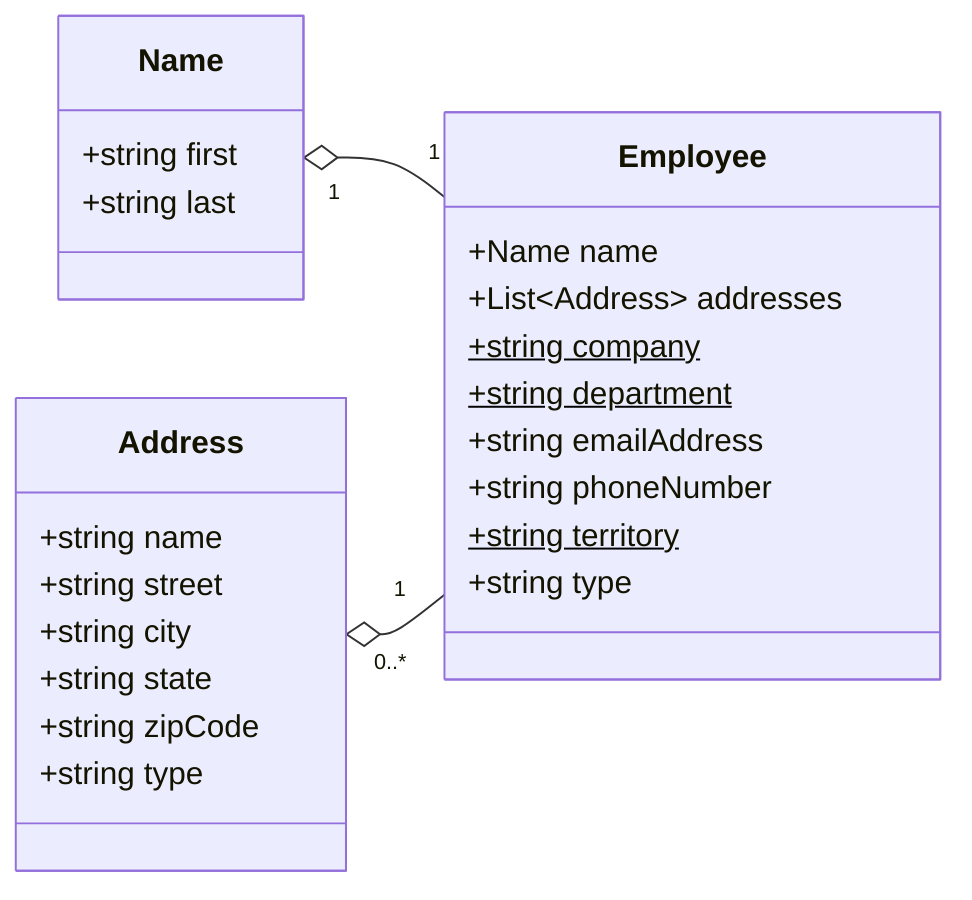
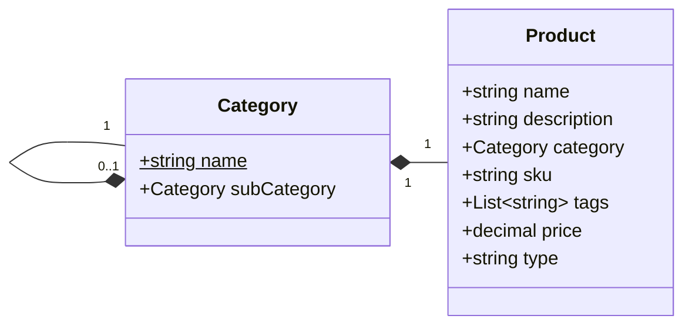

# ``CosmicWorks.Data`` fictituous data library

> *We are rebuilding cosmicworks as an open-source set of libraries and tools! Watch this repo and follow along as we work to v2 of this tool.*

## Overview

This library generates fictious data used in the **CosmicWorks** sample dataset.

> 💡 The **CosmicWorks** sample data is partially derived from [AdventureWorksLT](https://github.com/microsoft/sql-server-samples/tree/master/samples/databases/adventure-works).

## Usage

```csharp
using CosmicWorks.Data;
using CosmicWorks.Data.Models;

// Generate employees
IReadOnlyList<Product> products = await new ProductsDataSource().GetItemsAsync(
    count: 1000
);

// Generate products
IReadOnlyList<Employee> employees = await new EmployeesDataSource().GetItemsAsync(
    count: 200
);
```

## Data available

| | Description |
| --- | --- |
| **Employees** | Fictituous employee records based on a diverse set of names. |
| **Products** | Fictituous product records based on <https://adventure-works.com>. |

## Data schemas

Here's schemas for the data generated by using this tool:

### Employees



### Products



## Related

- [``CosmicWorks`` data generation CLI tool](https://www.nuget.org/packages/cosmicworks)
- [``CosmicWorks.Generator`` data seeding library](https://www.nuget.org/packages/cosmicworks.generator)