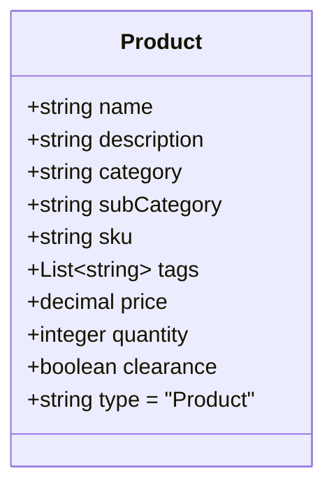
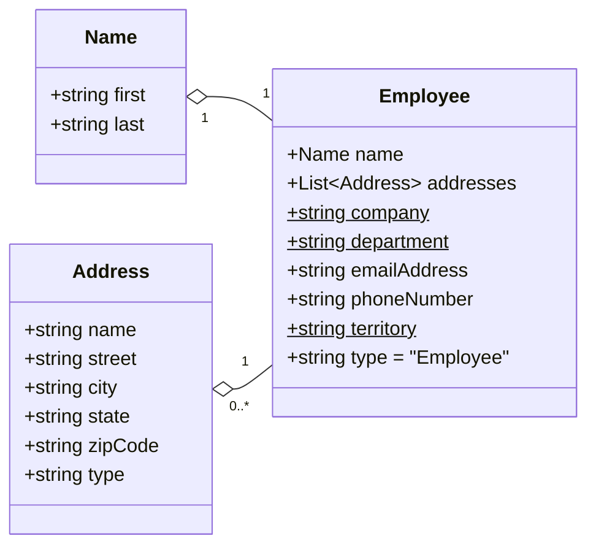

# `CosmicWorks.Models` models library

CosmicWorks is an open source set of tools and libraries to generate data quickly for your proof of concept or sample applications.

## Overview

Contains model classes for various items created by other CosmicWorks tools.

> 💡 The **CosmicWorks** sample data is partially derived from [AdventureWorksLT](https://github.com/microsoft/sql-server-samples/tree/master/samples/databases/adventure-works).

## Data schemas

Here's schemas for the data generated by using this tool:

### Products

### Employees

## Related

- [`CosmicWorks` data generation CLI tool](https://www.nuget.org/packages/cosmicworks)
- [`CosmicWorks.Data` fictituous data library](https://www.nuget.org/packages/cosmicworks.data)
- [`CosmicWorks.Generator` data seeding library](https://www.nuget.org/packages/cosmicworks.generator)
